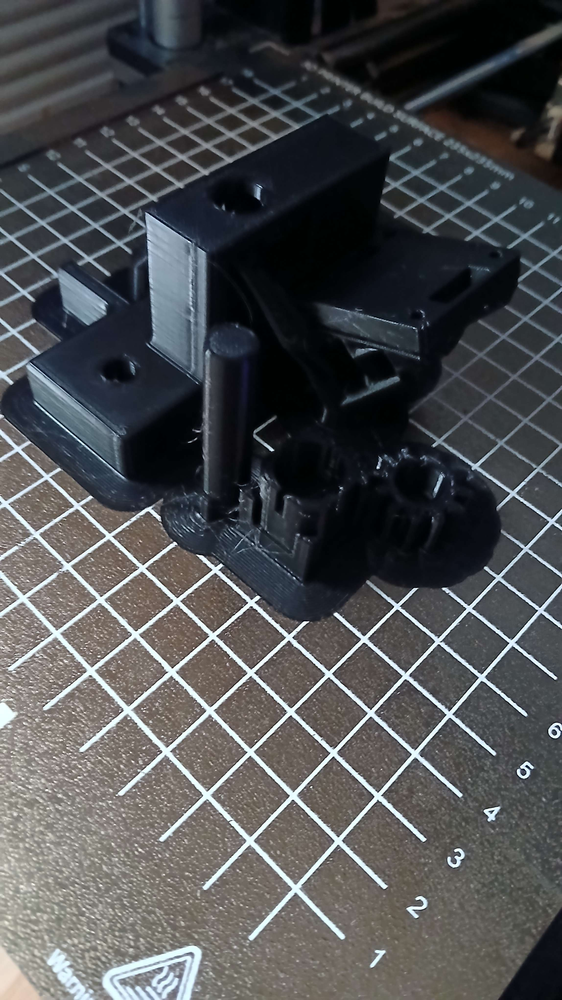
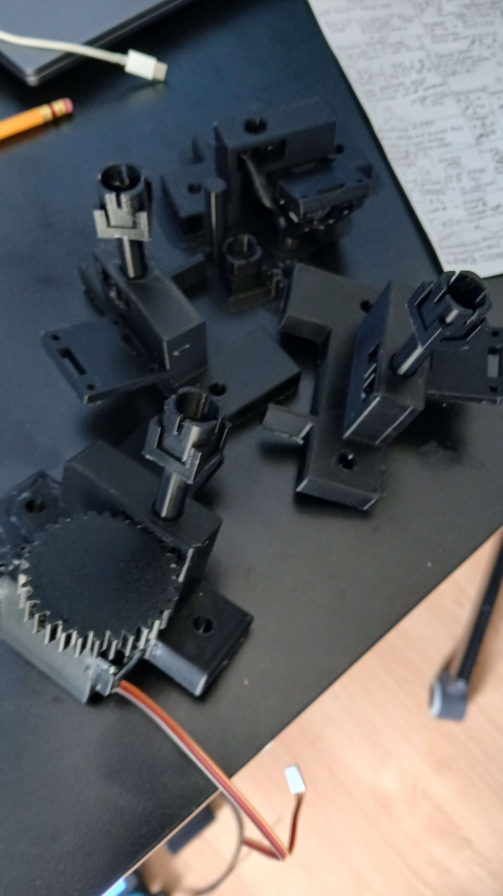
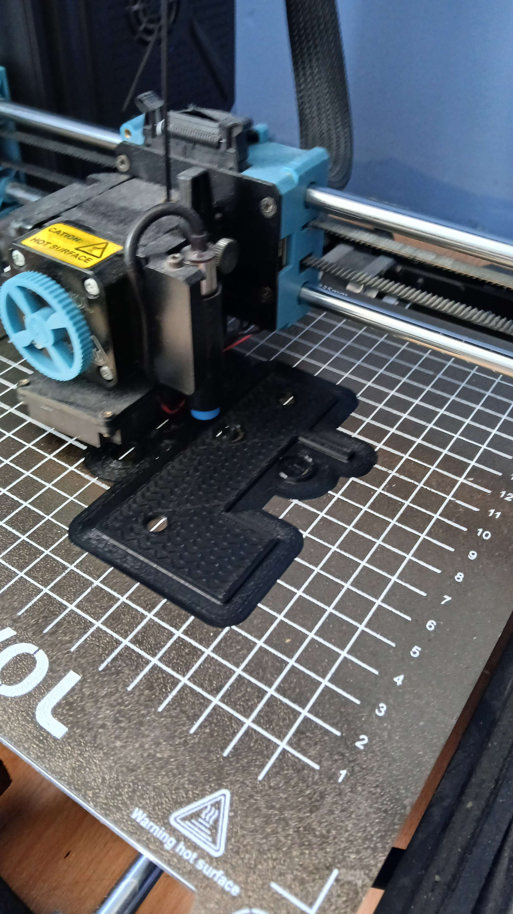
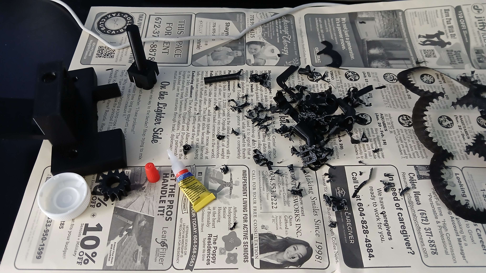
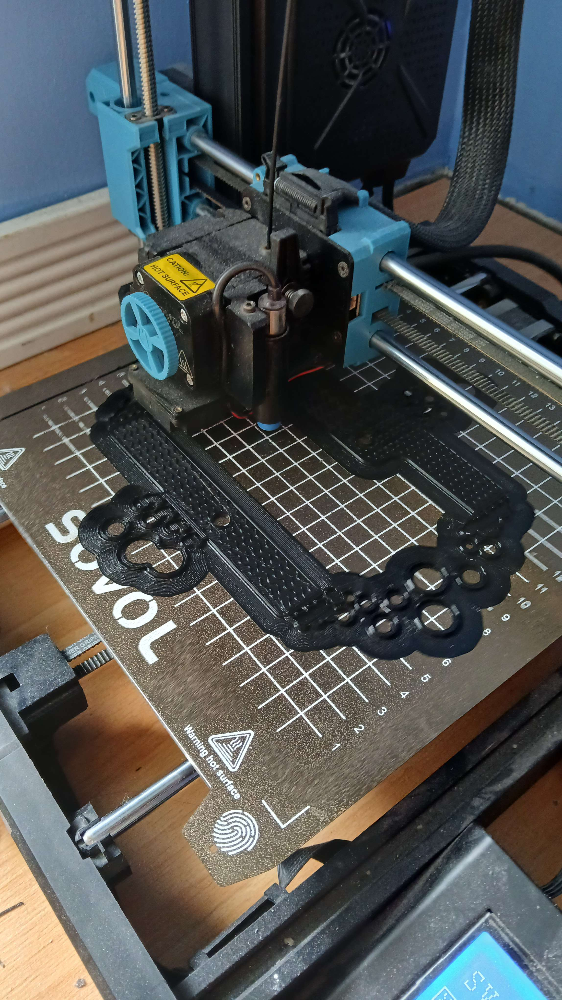
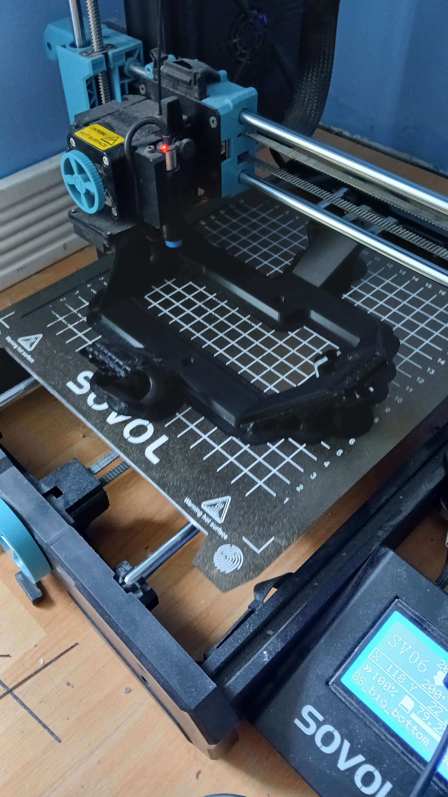
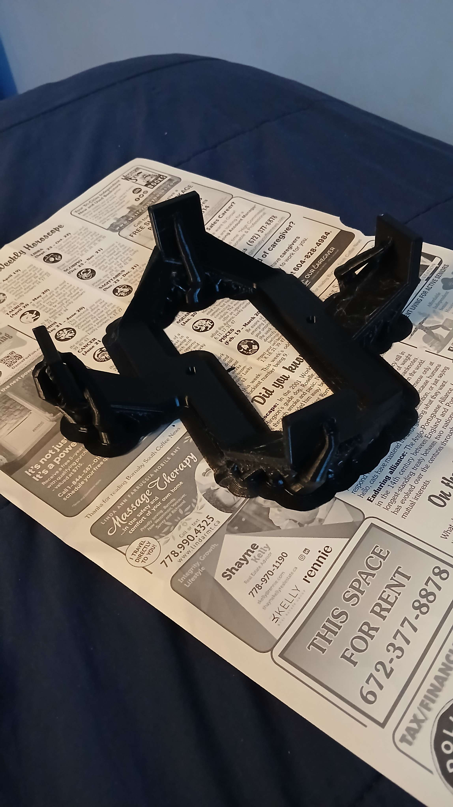
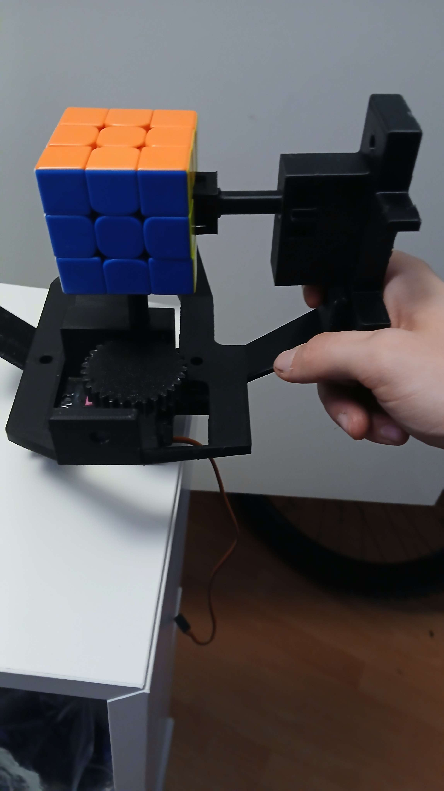
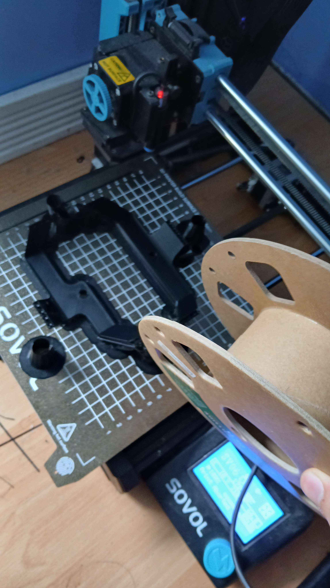

### Total Time: 38 hours
---

# May 15th: Started work!
Cooked up my idea and started researching the parts lying around in my kit and the school shop.

### Time today: 1 hour
### Time total: 1 hour

# May 17th:
Okay so basically I set up the platformio dev environment and got my esp32 driving an MG996R stepper motor.

https://github.com/user-attachments/assets/8cf88195-3297-4feb-9b49-cdf6550582a8

I've been wanting to create something like this for a while and I bought these components several months ago but never got around to seriously starting work on it. (And now it looks like Purdue beat me to it lol.)

Anyway I think the best way to properly begin this is to setup some goals for ***Cuber:***
- Create an automatic motorized Rubik's Cube solver.
- Have it automatically detect the initial state of the cube using colour sensors.
- Implement an algorithm like *Kociemba's* to solve the cube.
- Have an automatic scrambler to allow continuous action.
- 3D print a custom case to house components, that allows for easy access to the cube.

Wow that is a lot of goals haha.

To keep the kinematics of the cube simple, I will use a similar approach to the students at Purdue and MIT: 6 motors, one for each face of the  (no full cube rotations). To allow for access to the cube, I will allow the housing for each motor to swing out like a flower, letting me swap the cube in and out.

I got 6 TCS3200 colour sensors from my school, and the idea is that one could cover each face of the cube on the corner, and rotate the face at 30° intervals to detect all 12 stickers.

I then imported the MG996R into Fusion 360 and designed a pinion for the Rubiks cube. It will drive the cube sides by slotting into the middle piece. This is when I realized that the motor spline is to small for my 3D printer to print. Instead, I will use the injection molded pinion that came with the motors, and probably superglue the pinion to it or smt idk.

    
    
    

### Time today: 4 hours
### Time total: 5 hours

# May 19th:
Spent like 30 minutes today trying to make PlatformIO actually useable.

I played with my prototype pinion a bit and learned that I need to apply a ton of normal force to allow the sides to rotate.

###### No force (top) vs. force (bottom)
https://github.com/user-attachments/assets/cadc4695-f0eb-4065-a3e3-c17ea3f0df7f

https://github.com/user-attachments/assets/0a5ce550-07eb-4adf-b740-79804e6239e9

I will need to loosen my cube a lot for this, but not so much that it explodes in your face. Lubricant is also needed, I don't know what type to use though. I can buy some specialized stuff from SpeedCubeShop or just douse the cube in some machine oil from my school's shop lol.

I haven't had a lot of time these past couple days but hopefully I will have some more soon!

### Time today: 1 hour
### Time total: 6 hours

# May 23rd:
Finally got some spare time! Jumped into Fusion today and designed a prototype gearbox for the motor & pinion.

Because the version of the MG996R I have has only 180° of rotation, I need to make a step up to allow for full range of motion. I went with a 1:2.5 gear ratio via a 30T pinion and a 12T gear. Not gonna lie the MG996R has a ton of torque—I did the math from the specsheet and I could go up to like 1:8 or something.

Anyway, the 1:2.5 ratio works as all of the angles I need are whole numbers.

<!-- Image.png -->

I'll be able to 3D print this over the weekend and test it out. If it works, I'll be able to attach 6 of these together to create a full robot. I'm still thinking about how to get the cube in and out though. The flower idea I mentioned early is probably too complex. I'll maybe make the top motor attached via a bolt that you can screw in and out. 

But now that we know we need a large normal force, we may have difficulty getting the cube in and out. When I have time I'll fiddle around with my pinion and see how much play there is and if it would be possible to twist the cube out. Otherwise we may need multiple motors to be unscrewable.

### Time today: 2 hours
### Time total: 8 hours

# May 24th & 25th:
Printed the gearbox. Turns out I suck at superglueing stuff together. Note to future self: sand the prints before gluing lmao.

Got it rotating and stuff. But I'm browning out the ESP32 on just a single stepper motor. Tomorrow I'll be able to take it to school and test it with an actual power supply.

https://github.com/user-attachments/assets/a11832de-1fdf-4844-b957-5d1f5c20488e

### Time this weekend: 4 hours
### Time total: 12 hours

# May 30th

So whats up. I tested the jig with a power supply and theres a couple things I learned:
- I need to make it stiffer so that the gears dont twist out.
- I suck at estimating tolerances.

For most of my testing time, the pieces of the cube were catching on each other, so I had to tighten the cube faces down. It was able to rotate the sides of the cube, but it was quite innacurate due to how much tolerance there was in the pinion and the gears.

I originally created a glue down cover for the pinion to rotate in, but my friend suggested that I make the shaft slide in and have the pinion be press fit.

### Time today: 1 hour
### Time total: 13 hours

# May 31st

Printed some tolerance tests.
- Print in place: 0.5mm
- Print out of place: 0.5mm
- Press fit: 0.3mm

Also designed a new pinion to better fit the cube. Reduced the tolerance between the pinion and the walls of the piece, and made it wrap around the corners. Not sure if the corner pieces actually do anything but maybe it increases the torque lever arm 🤷‍♂️.

### Time today: 3 hours
### Time total: 16 hours

# June 1st
Printed out the new gearbox and assembled it together. I need to update it a little as its too close to the face of the cube and the other sides of the cube can't actually rotate lol.

### Time today: 2 hours
### Time total: 18 hours

# June 2nd
Brought it to school and tested it out. Works much better with a lot more backlash. I can still reduce the last bit of it by adding a shaft to the pinion gear, keeping it from rocking side to side. Other than that, its pretty sweet. Something I've noticed is that for some reason the motor isn't linear. 0-90 is the same as 90-180, but 180-270 is much smaller. All stuff that can be changed in software.

https://github.com/user-attachments/assets/d39e9d64-2d36-401b-b0da-273edd4b6365

Hopefully v3 will be the final version of the gearbox. Once I confirm that works then I can start cadding the full assembly.

### Time today: 2 hours
### Time total: 20 hours

# June 6th
Spliced this power supply to power my esp32 and motors. It's 5V 10A, and each motor draws 2A maximum. Hooked it up and it works! I also looked into the specs of the jumper wires I was using and i could power up to 2 motors at a time. (22 AWG, 4A).

### Time today: 1 hour
### Time total: 21 hours

# June 7th
Started playing with the colour sensors. I tried using a library and wasted hours getting it to work. I instead settled to just doing all the fancy stuff manually. I got it able to differentiate between red, green, and blue, but I really need to calibrate the values and tune the thresholds it if I want accurate colours. I think I might need to do this for all 6 sensors.

Colour sensors pmo.

### Time today: 4 hours
### Time total: 25 hours

# June 8th
Dude the colour sensor works. IT WORKS.

I took min and max values for red, green, and blue, and then used this funky map function I found to map it to 0-255. I then used colour normalization to get the ratios of the colours (brightness independent). I then measured each side of the cube, getting the RGB ranges from right up against the cube to about 2 inches away. I could then just iterate over all my colours to find out which RGB band it falls into.

So excited to get this working. I will probably have to recalibrate it when I make the assembly, and also do it for 5 other sensors :(

However, now I know how to do it, so it should be faster next time!

From now I want to focus on integrating a sensor mount into the gearbox, and combining everything into a single 6 motor assembly. I will probably also have to make a wiring diagram. These colour sensors require a lot of pins, (5 exactly) but two of them (the ones that set the frequency) can be shared across all of them, saving 10 pins.

https://github.com/user-attachments/assets/c96f8a81-6cd7-4bb0-83de-4ab9377df998

### Time today: 2 hours
### Time total: 27 hours

# June 9th

Extended the drive shaft so that the cube wouldnt be blocked by the gearbox when turning. Added a mount for the colour sensor to the gearbox. I then also added some mounting holes and arranged the 6 gearboxes into an assembly.

It's really coming together!

I need to make the "net" that connects the 6 gearboxes together. The net will go on the inside of the gearboxes so that you can undo the bolts and just take them out without any maneuvering I also want to figure out how to make the wiring nice. It's gonna be so cooked because of how much there will be. I need 8 wires per gearbox (48 total) + more for splitting my power and ground. At the bottom of the assembly I can make a case for the ESP32. It might even be a good idea to make some buttons for control ("start", "stop"). But yeah. It's gonna be so good.

### Time today: 4 hours
### Time total: 31 hours

# June 10th
Holy lock in.

Made some "nets" that connects the gearboxes together, and a box to store all the electronics. The gearboxes mount to the net via 1/4-20 bolts, and when you unscrew them you can just take it right out with minimal fuss.

The CAD is mostly finished at this point. I had to make a few small modifications to get the colour sensor to fit.

I then made the wiring schematic in Fusion. It turned out a lot cleaner than I expected, but jesus it is a lot of wires. There will be lots of splicing and soldering to do for VBUS, GND, and sensor pins.

### Time today: 7 hours
### Time total: 38 hours

# June 11th
Printed a gearbox. These take a lot of time lol. Cleaned it up and removed the supports, then assembled it.

### Time today: 1 hour
### Time total: 39 hours

# June 12th
Printed another gearbox lol. I can really only print one a day because I like sleeping too much.

### Time today: 1 hour
### Time total: 40 hours

# June 13th
Yo so basically I goofed up in the CAD. Turns out the pinion was pressed further into the gear than I thought, so I made everything too close to the cube (As I was assembling the gearboxes with the shaft pressed perfectly into the gear). I had to spend some time modifying the nets to reach out a bit further (0.225") in each direction so that everything would fit. But now it's all good! I'll be able to get a bunch of printing and assembly done this weekend.

### Time today: 2 hours
### Time total: 42 hours

# June 14th
Printed 2 gearboxes.

# June 15th
Printed another gearbox lol.

# June 16th
Printed the final gearbox. I also printed some of the gears but that will take some time.

    
    
    
    

Yo so I did a bunch of boilerplate code for the colour sensors and servos. It's all placeholder values as I can't actually get the real constants until it is fully built.

The plan right now:
- Print gears
- Glue pinions to servos, and servos to gearboxes
- Print the nets
- While printing, write colour detection algorithm and implement Kociemba's
- Assemble the entire thing
- Wire it up & test functionality of each motor and sensor
- Calibrate the sensors
- Calibrate motors
- Test it!

### Time today: 4 hours
### Time total: 46 hours

# June 17th
Yo so I printed the gears 👍

### Time today: 1 hour
### Time total: 47 hours

# June 18th
I printed the bottom net. It took 12 hours but it's done! Looks great and it's fairly stiff so it won't flex under the weight of everything.

    
    
    
    

### Time today: 2 hours
### Time total: 49 hours

# June 19th
Me when I forgot to order new filament.

New roll isn't coming until tomorrow. I did get my connectors and wires though so I can start splicing stuff.

### Time today: 1 hour
### Time total: 50 hours